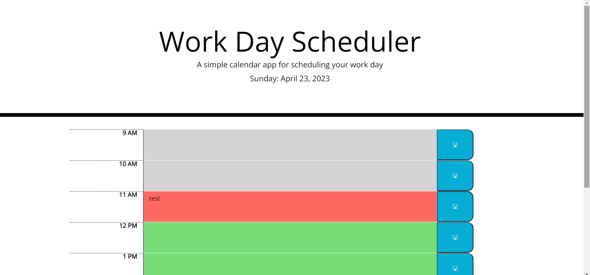

# Homework 05 Third-Party APIs: Work Day Scheduler

## Description

This is a work day schedule application that allows a user to save events for each hour of the day. This app will run in any browser using HTML, CSS, javascript with jQuery and DayJS third party API's.

